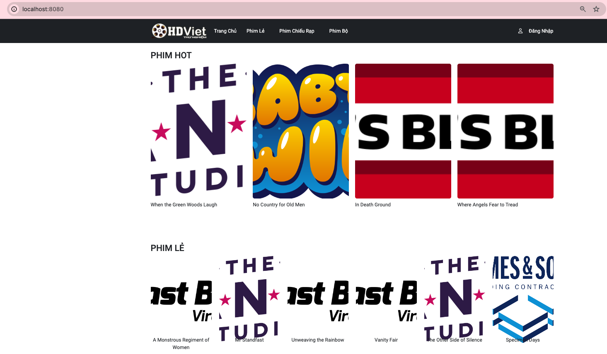
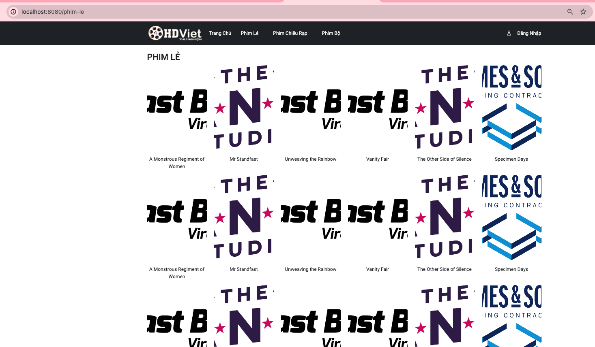
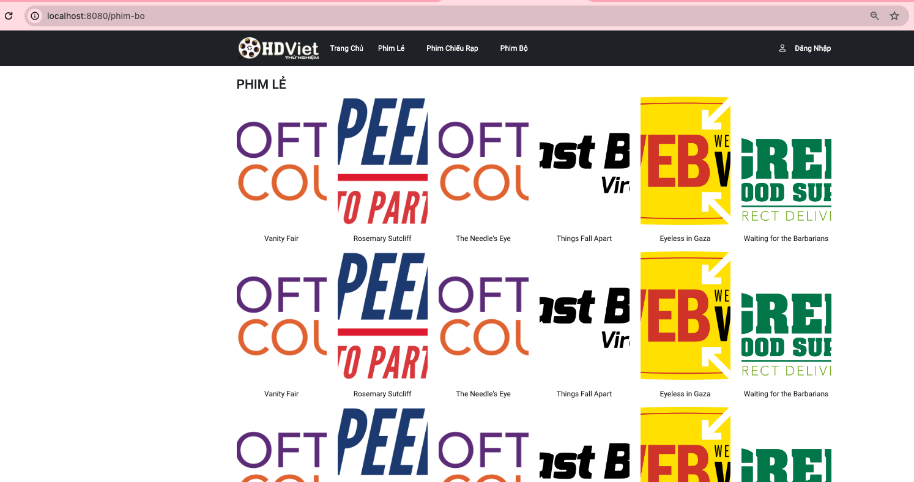
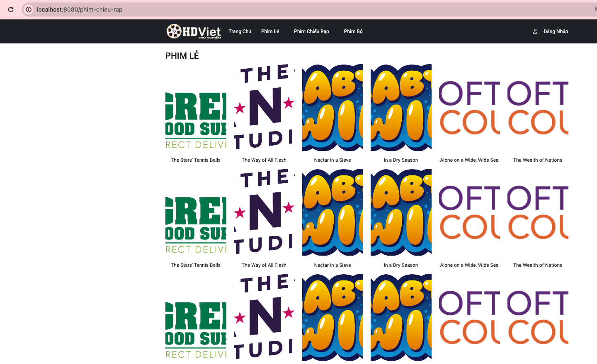
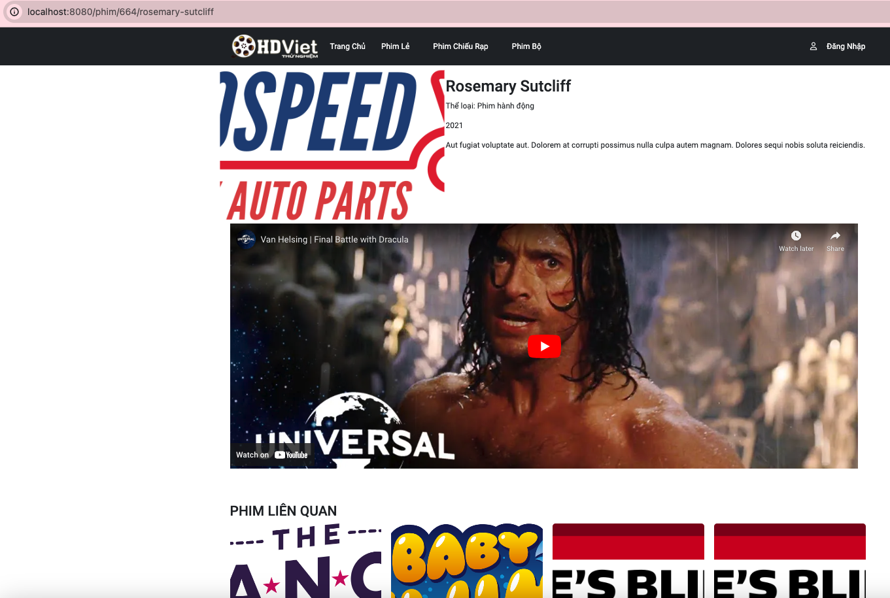

# Movie Application

## Hướng dẫn cài đặt MySQL

### Cách 1: Download và cài đặt MySQL qua hướng dẫn tại https://dev.mysql.com/doc/refman/8.2/en/installing.html
### Cách 2: Cài đặt MySQL trên docker
	+ Cài đặt docker qua hướng dẫn: https://docs.docker.com/desktop/
	+ Cài đặt MySQL bằng docker commdline: `docker run --name mysql -e MYSQL_ROOT_PASSWORD=123 -p 8585:3306 -d mysql:latest`
	+ Sau khi cài đặt, user là root và password là 123

## Hướng dẫn cài đặt MySQL Workbench
	+ Download MySQL Workbench qua hướng dẫn: https://dev.mysql.com/doc/workbench/en/wb-installing.html
	+ Tạo MySQL Connection với user/pass đã tạo khi cài đặt MySQL (root/123)

## Hướng dẫn khởi động chương trình
1. Prerequisite Software or Component
   + Java 17 or later
   + Maven 3.6.3 or later
   + IDE: Eclipse or IntelliJ or any desired IDEs for Java application development

2. How to start application
   + Run Maven command: `mvn spring-boot:run`

3. How to check the application
   + Open browser and access url: http://localhost:8080/

## Trang chủ

## Danh sách phim lẻ

## Danh sách phim bộ

## Danh sách phim chiếu rạp

## Chi tiết phim

